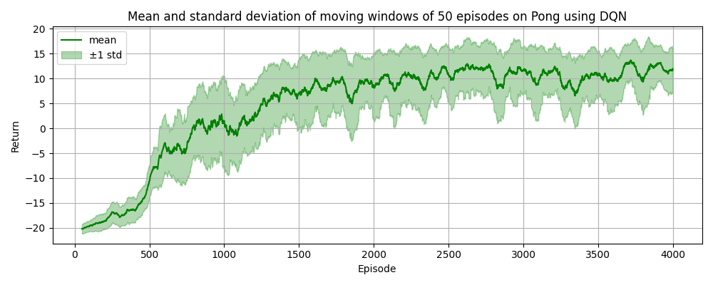

# Reinforcement Learning Project -- DQN on Atari Games & DDPG on MuJoCo

## Get Started

### Installation

```bash
git clone https://github.com/Geral-Yuan/RL_Project.git
cd RL_Project
conda create -n RL_Env python=3.9 -y
conda activate RL_Env
pip install -r requirements.txt
```

### Quick Test

Run the corresponding script to test the algorithm on the target environment using the checkpoint files provided in `ckpt` directory by default.

```bash
bash scripts/test/Pong.sh
bash scripts/test/Boxing.sh
bash scripts/test/HalfCheetah.sh
bash scripts/test/Ant.sh
```

or directly enter the corresponding command in the terminal to run the test:

```bash
python run.py --env_name Pong-v5
python run.py --env_name Boxing-v5
python run.py --env_name HalfCheetah-v4
python main.py --env_name Ant-v4
```

There will be an episode return printed in the terminal. And the rendering of the agent in the environment is saved in `gif` directory for the user to check the performance.

### Training

You can modify the hyperparameters in corresponding json files in `config` directory, and then run the training script:

```bash
bash scripts/train/Pong.sh
bash scripts/train/Boxing.sh
bash scripts/train/HalfCheetah.sh
bash scripts/train/Ant.sh
```

or directly enter the training command with optional arguments in the terminal like:

```bash
python run.py --env_name Pong-v5 --train --save_ckpt
python run.py --env_name Boxing-v5 --train --save_ckpt
python run.py --env_name HalfCheetah-v4 --train --save_ckpt
python main.py --env_name Ant-v4 --train --save_ckpt
``` 

## Results

### Training Curves

The four figures below show the training curves of my DQN agent on Pong and Boxing, and DDPG agent on HalfCheetah and Ant.




The following two figures show the comparison of my DDPG with improving modifications with the original DDPG algorithm on HalfCheetah and Ant environments.


### Agent Rendering


